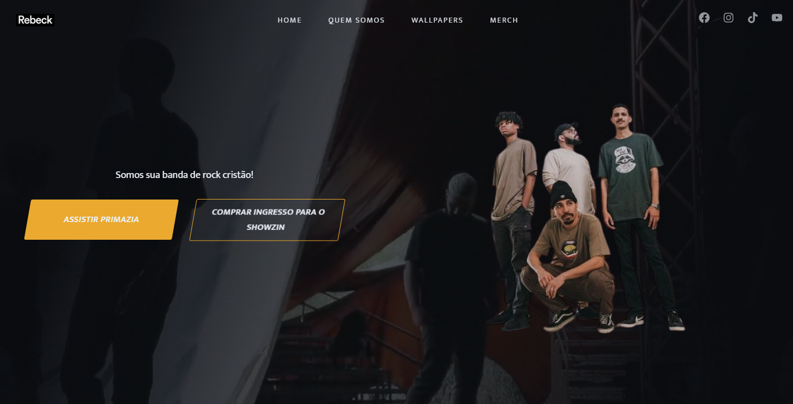

<h1 align="center">
  Site da Banda Rebeck
</h1>

  

<h2> 💻 Projeto</h2>

Este projeto visa a implementação de um site simples com o uso do _HTML_ e _CSS_.

<h2> 🚀 Tecnologias</h2>

- HTML
- CSS
- [AOS Animate](https://michalsnik.github.io/aos/)

<h2>📔 Conhecimentos abordados</h2>

<ul>
  <li>Uso semântico do HTML</li>
  <li>Carregamento de video no background</li>
  <li>Váriaveis do css no `:root`</li>
  <li>Animações com a biblioteca [AOS](https://michalsnik.github.io/aos/)</li>
  <li>Efeitos com a propriedade `transform` do css</li>
</ul>
